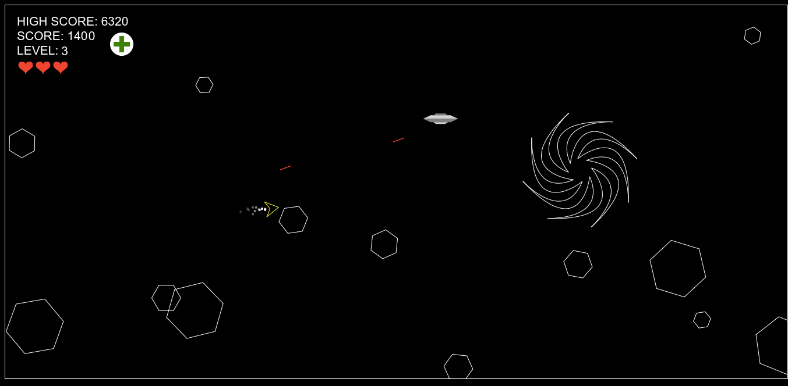

# What I learned:
* Writing first program on javascript

# Task:
Creating a version of the game `asteroids`.

## How to run:

Opening the html file in the browser should start the game.
If the game doesn't start uncheck `Block third party cookies` in the browser settings.
Under Chrome go to: `Settings -> Advanced -> Privacy and security -> Site settings -> Cookies and site data -> Block third party cookies`. This is because the program utilizes a local storage to save high score.

## How to play:
A - turn left

W - move forward

D - turn right

SPACE - shoot bullets

